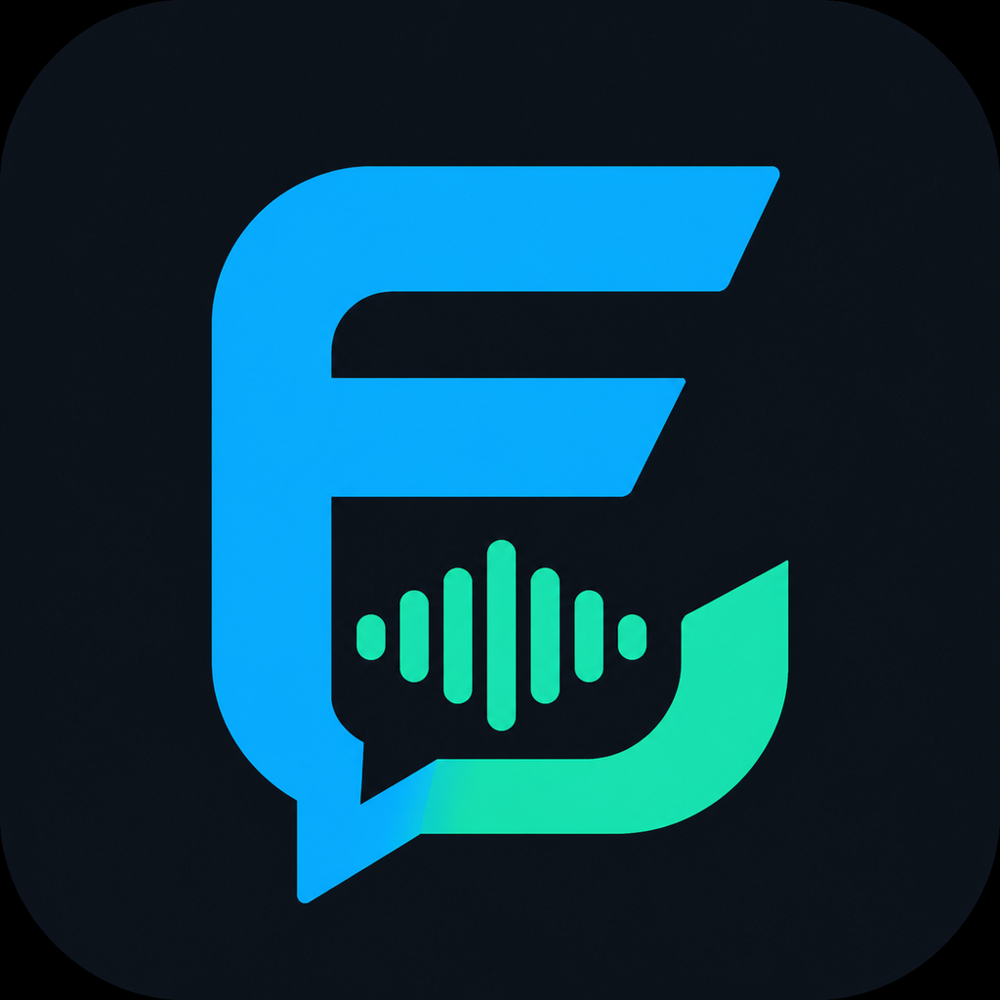

<p align="center">
  
</p>

# FreeCord

FreeCord is a self-hosted desktop community app for persistent text chat, low-latency voice, screen sharing, roles, and file sharing. One FreeCord installation hosts one private community. The desktop client is built with Electron, React, and TypeScript; the server uses Node.js, PostgreSQL, LiveKit, and MinIO.

> **Early alpha:** FreeCord `0.8.0-alpha.6` is intended for hands-on testing. Installers are unsigned, upgrades may require manual work, and the project has not received an independent security audit.

[Download the latest release](https://github.com/calebast/FreeCord/releases/latest) · [Deployment guide](docs/DEPLOYMENT.md) · [Configuration reference](docs/CONFIGURATION.md) · [Support FreeCord](https://buymeacoffee.com/calebast)

## What works today

- Invite-only accounts with an initial owner, refresh-token rotation, roles, permissions, account recovery, and audit events
- Persistent channels, encrypted text messages, edits, deletion, mentions, reactions, custom emotes, GIF search, local decrypted search, and pagination
- LiveKit voice channels with device selection, mute, deafen, voice activity, per-user volume, RNNoise, echo cancellation, and reconnect handling
- Screen sharing with selectable quality, frame rate, bitrate, multi-stream viewing, and stream volume controls where the operating system exposes capture audio
- Avatars, presence, shared-file browsing, image/audio/video attachments, and an optional isolated Copyparty surface
- Docker Compose deployment with PostgreSQL, LiveKit, MinIO, and the FreeCord API

## Platform status

| Platform | Package | Current status |
| --- | --- | --- |
| Windows 10/11 x64 | NSIS `.exe` | Primary test platform; unsigned installer shows a Windows warning |
| CachyOS / Arch x64 | AppImage | Primary Linux target; KDE Plasma on Wayland with PipeWire is the supported configuration |
| Other Linux desktops | AppImage | May work but are not currently release-qualified |
| Browser | None | FreeCord is desktop-only; no web client is included |

See [Platform support](docs/PLATFORM_SUPPORT.md) for known limitations.

## Quick start

1. Give the server two public DNS names, such as `api.example.com` and `rtc.example.com`.
2. Clone this repository, copy `.env.example` to `.env`, and set the public `LIVEKIT_URL` plus a strong initial owner password.
3. Pull the published service images with `docker compose pull`.
4. Open TCP `443` and `7881`, plus UDP `50000-50010`, at the host and upstream firewall. Forward them through NAT when applicable.
5. Adapt `deploy/Caddyfile.example`, then run:

   ```sh
   docker compose up -d
   docker compose ps
   curl https://api.example.com/health
   ```

6. Install the desktop client, enter `https://api.example.com`, and sign in with the bootstrap owner credentials.
7. Create invitation tokens from the owner/admin interface. Remove the bootstrap password from the deployment after the owner exists.

The same `compose.yaml` can be pasted directly into Portainer's Web Editor; no Git checkout or server-side build tools are required. Portainer steps, backup guidance, and upgrade instructions are in [Deployment](docs/DEPLOYMENT.md).

## Architecture

```text
FreeCord desktop client
  |-- HTTPS + server-sent events --> FreeCord API --> PostgreSQL
  |                                      |
  |                                      +---------> MinIO / S3 objects
  |
  +-- WebRTC signaling + media --------> LiveKit
                                         |-- UDP media (preferred)
                                         +-- TCP fallback
```

The Electron renderer has no Node.js access. A context-isolated preload exposes a fixed, typed IPC surface. Database, S3, LiveKit, and signing secrets stay on the server.

## Encryption and privacy

Text content is encrypted in the desktop renderer with AES-256-GCM using a community chat key carried by invitation. The server stores ciphertext and metadata. This is an early implementation, not an audited multi-device key-management protocol: losing the local key can make history unreadable, and resetting a password does not recover it. Message attachments and voice/video are transport-encrypted but are currently readable by the self-hosted server/media infrastructure; they are **not end-to-end encrypted**.

Read [Security](SECURITY.md) and [Architecture](docs/ARCHITECTURE.md) before exposing a server publicly.

## Development

Requires Node.js 22.12 or newer, Python 3 for contract tests, and Docker Compose for a full stack.

```sh
cd server
npm ci
npm test

cd ../apps/desktop
npm ci
npm run typecheck
npm run build
```

Run all repository contract checks from the root with:

```sh
python -m unittest discover -s tests -v
database/validate.sh 10
```

See [Contributing](CONTRIBUTING.md) before opening a pull request.

## Project status and support

FreeCord is independent open-source software and is not affiliated with Discord, TeamSpeak, or their owners. Bug reports and focused pull requests are welcome. If the project is useful to you, you can [buy me a coffee](https://buymeacoffee.com/calebast).

FreeCord is distributed under the [BSD 3-Clause License](LICENSE). Bundled dependency licenses are listed in [Third-party notices](docs/THIRD_PARTY_NOTICES.md).
